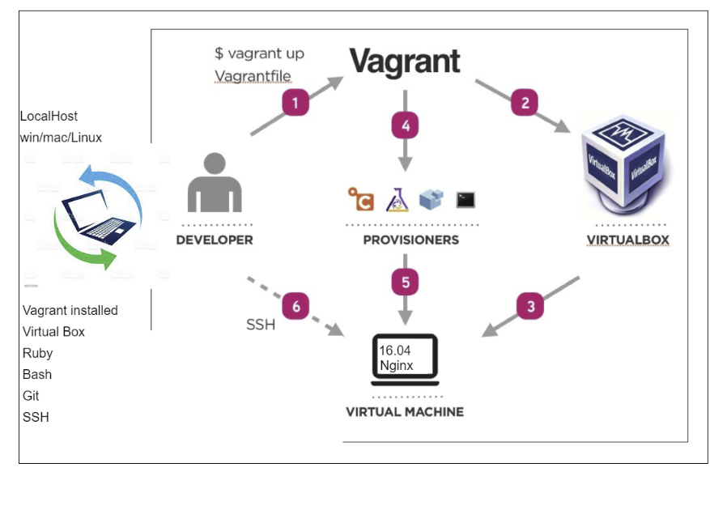

# DevOps Intro
## Life before DevOps
- Devleopers and Operations Working separately 
- Waterfall Model
- Spend a long time developing only for bugs to arise during production
- Transition to Agile and SCRUM

### Why DevOps
- Communication between development and operations team
- Iterative cycles so bugs can be found and fixed as they arise
- Reduce time between committing a change and the change being placed in production
#### Key pillars of DevOps
- Ease of use
- Flexibility
- Robustness
- Cost

##### Monolith Architecture
- Presentation, application, and data composed all in one piece
- If there is a problem it all goes down
- Can be useful for small applications
- Not good for Large Applications


### Development Environment


**Development Environment Considerations**
- What are you planning to develop?
- Standardized
- Robust
- Automate tasks
- Portable - VM - Container Docker

**DevOps Introduction**
- DevOps is a culture that bridges gap between Development and Operation
- Shared development environment to reduce errors
- continuous integration / continuous delivery more efficient

# Vagrant
- Automate the setup of virtual development environments

## Create `Vagrantfile` in the current location
```
Vagrant.configure("2") do |config|

 config.vm.box = "ubuntu/xenial64"
# creating a virtual machine ubuntu


# assign private ip to our VM
 config.vm.network "private_network", ip: "192.168.10.100"

# Ensure to install hostsupdater plugin on our localhost before rerunning the vagrant
 config.hostsupdater.aliases = ["development.local"]

end
```
To sync app folder onto machine
```
config.vm.synced_folder ".","/home/vagrant/app"
```

## Create `provison.sh` in `app` directory
```
#!/bin/bash

# Update and upgrade packages
sudo apt-get update -y
sudo apt-get upgrade -y

# Install nginx
sudo apt-get install nginx -y
```
**Change Permissions to allow execution of script**
```
sudo chmod +x provision.sh
```

## Provisioning
- Add to end of vagrant file to run script as part of the vagrant up process
```
config.vm.provision "shell", path: "app/provision.sh"
```
## How to SSH into VM
```
vagrant ssh
```
### Check status of nginx
```
sudo systemctl status nginx
sudo systemctl start nginx
sudo systemctl stop nginx
```

## Vagrant commands:
```
Common commands:
     autocomplete    manages autocomplete installation on host
     box             manages boxes: installation, removal, etc.
     cloud           manages everything related to Vagrant Cloud
     destroy         stops and deletes all traces of the vagrant machine
     global-status   outputs status Vagrant environments for this user
     halt            stops the vagrant machine
     help            shows the help for a subcommand
     hostsupdater
     init            initializes a new Vagrant environment by creating a Vagrantfile    
     login
     package         packages a running vagrant environment into a box
     plugin          manages plugins: install, uninstall, update, etc.
     port            displays information about guest port mappings
     powershell      connects to machine via powershell remoting
     provision       provisions the vagrant machine
     push            deploys code in this environment to a configured destination       
     rdp             connects to machine via RDP
     reload          restarts vagrant machine, loads new Vagrantfile configuration      
     resume          resume a suspended vagrant machine
     snapshot        manages snapshots: saving, restoring, etc.
     ssh             connects to machine via SSH
     ssh-config      outputs OpenSSH valid configuration to connect to the machine      
     status          outputs status of the vagrant machine
     suspend         suspends the machine
     up              starts and provisions the vagrant environment
     upload          upload to machine via communicator
     validate        validates the Vagrantfile
     version         prints current and latest Vagrant version
     winrm           executes commands on a machine via WinRM
     winrm-config    outputs WinRM configuration to connect to the machine
```

# Testing Development Environment
- **Tests written in Ruby**

## **Testing**

In `starter-code/environment/spec-tests`

Requirements
```
gem install bundler
bundler
```
To run test
```
rake spec
```
## Multi-Machine `Vagrantfile`
```
Vagrant.configure("2") do |config|
  
  config.vm.define "app" do |app|
    app.vm.box = "ubuntu/xenial64"
    app.vm.network "private_network", ip: "192.168.10.100"
    app.hostsupdater.aliases = ["development.local"]
    app.vm.provision "shell", path: "environment/provision.sh"
  end

  config.vm.define "db" do |db|
    db.vm.box = "ubuntu/xenial64"
    db.vm.network "private_network", ip: "192.168.10.150"
    db.vm.provision "shell", path: "environment/db/provision.sh"
  end 
  
  # Sync folder from OS to VM
                # "." means current location - into/inside our VM -
  config.vm.synced_folder ".", "/home/vagrant/app"

end
```

## App `provision.sh`
```
#!/bin/bash

# Update the sources list
sudo apt-get update -y

# upgrade any packages available
sudo apt-get upgrade -y

# install nginx
sudo apt-get install nginx -y

# install git
sudo apt-get install git -y

# install nodejs
sudo apt-get install python-software-properties
curl -sL https://deb.nodesource.com/setup_12.x | sudo -E bash -
sudo apt-get install nodejs -y

# install pm2
sudo npm install pm2 -g
```

## DB `provision.sh`
```
# be careful of these keys, they will go out of date
sudo apt-key adv --keyserver hkp://keyserver.ubuntu.com:80 --recv D68FA50FEA312927
echo "deb https://repo.mongodb.org/apt/ubuntu xenial/mongodb-org/3.2 multiverse" | sudo tee /etc/apt/sources.list.d/mongodb-org-3.2.list

sudo apt-get update -y
sudo apt-get upgrade -y

# sudo apt-get install mongodb-org=3.2.20 -y
sudo apt-get install -y mongodb-org=3.2.20 mongodb-org-server=3.2.20 mongodb-org-shell=3.2.20 mongodb-org-mongos=3.2.20 mongodb-org-tools=3.2.20


# if mongo is is set up correctly these will be successful
sudo systemctl restart mongod
sudo systemctl enable mongod
```
## Configuring machines

### DB
In `/etc/mongod.conf`
```
sudo nano /etc/mongod.conf
Change bindIP to 0.0.0.0
``` 
### App
In `.bashrc` add persistent env var `DB_HOST`
```
DB_HOST="mongodb://192.168.10.150:27017/posts"
```
Then run command:
```
node seeds/seed.js
```
Finally to run npm in background:
```
(npm run start&)
```
# Linux commands
- Who am I `uname` or `uname -a`
- Where am I `pwd` will display current location
- How can I list contents including hidden files `ls -a`
- Delete file `rm filename` or `rm -rf filename`
- Create a file `touch filename` or `nano filename`
- Create a dir `mkdir dir-name`
- Navigate inside dir `cd name_dir`
- List all processes running `ps aux` or `top`
- How to kill a process `kill process id/s`
- Wildcard is used to deal with multiple files with same extension `*`
- File permissions `+x executable`
- `read (r) write (w)`
- Check permissions `ll`
- Change permission `chmod permission_reqired filename`
- Copy file or folder `cp file newfile` `cp source dest`
- Cut paste - move file or folder `mv`
- How to use piping | `ls | head -2`

-**Variable and Environment Variable**
- How to check env var? `env`
- Creating env var `export key=value` `export name=conor`
- `printenv name`
- Make env var persistent - command in `.profile` or `.bashrc` file - have to exit and reconnect

# Setting up Nginx on VM

start the app machine and SSH connect:
```
vagrant up
vagrant ssh app
```

go to `/sites-available` directory:
```
cd /etc/nginx/sites-available
```
open `default` file:
```
sudo nano default
```
Paste this code into the server block where the location / { is: 
```
    location / {
        proxy_pass http://localhost:3000;
        proxy_http_version 1.1;
        proxy_set_header Upgrade $http_upgrade;
        proxy_set_header Connection 'upgrade';
        proxy_set_header Host $host;
        proxy_cache_bypass $http_upgrade;
    }
```
# provision script for app and db
- create a file for nginx.conf on localhost
```
   location / {
     proxy_pass http://localhost:3000;
     proxy_http_version 1.1;
     proxy_set_header Upgrade $http_upgrade;
     proxy_set_header Connection 'upgrade';
     proxy_set_header Host $host;
     proxy_cache_bypass $http_upgrade;
    }
```
 
- create a file for mongod.conf
```
sudo nano /etc/mongod.conf
Change bindIP to 0.0.0.0
```
 
- provision.sh for app
```
#!/bin/bash

# Update the sources list
sudo apt-get update -y

# upgrade any packages available
sudo apt-get upgrade -y

# install nginx
sudo apt-get install nginx -y

# install git
sudo apt-get install git -y

# install nodejs
sudo apt-get install python-software-properties
curl -sL https://deb.nodesource.com/setup_12.x | sudo -E bash -
sudo apt-get install nodejs -y

# install pm2
sudo npm install pm2 -g

# remove vm nginx config and replace with local config
sudo rm -rf /etc/nginx/sites-available/default
sudo cp app/app/default /etc/nginx/sites-available/

#remove rm .bashrc and replace with local version
sudo rm -rf .bashrc
sudo cp app/app/.bashrc . 
source ~/.bashrc

# if nginx is is set up correctly these will be successful
sudo systemctl restart nginx
sudo systemctl enable nginx
```
 
- provision.sh for db
```
#!/bin/bash

# Update the sources list
sudo apt-get update -y

# upgrade any packages available
sudo apt-get upgrade -y

# install nginx
sudo apt-get install nginx -y

# install git
sudo apt-get install git -y

# install nodejs
sudo apt-get install python-software-properties
curl -sL https://deb.nodesource.com/setup_12.x | sudo -E bash -
sudo apt-get install nodejs -y

# install pm2
sudo npm install pm2 -g

# remove vm nginx config and replace with local config
sudo rm -rf /etc/nginx/sites-available/default
sudo cp app/app/default /etc/nginx/sites-available/

# remove rm .bashrc and replace with local version
sudo rm -rf .bashrc
sudo cp app/app/.bashrc . 
source ~/.bashrc

# if nginx is is set up correctly these will be successful
sudo systemctl restart nginx
sudo systemctl enable nginx
```
- Vagrantfile
```
Vagrant.configure("2") do |config|
  
  config.vm.define "db" do |db|
    db.vm.box = "ubuntu/xenial64"
    db.vm.network "private_network", ip: "192.168.10.150"
    db.vm.synced_folder ".", "/home/vagrant/app"
    db.vm.provision "shell", path: "environment/db/provision.sh"
  end 

  config.vm.define "app" do |app|
    app.vm.box = "ubuntu/xenial64"
    app.vm.network "private_network", ip: "192.168.10.100"
    app.vm.synced_folder ".", "/home/vagrant/app"
    app.vm.provision "shell", path: "environment/provision.sh"
  end
  

end
```
- set up an env var once the db is up
- seeds db if needed
- add dependencies in .gitignore
- restart app and db once conf is changed
